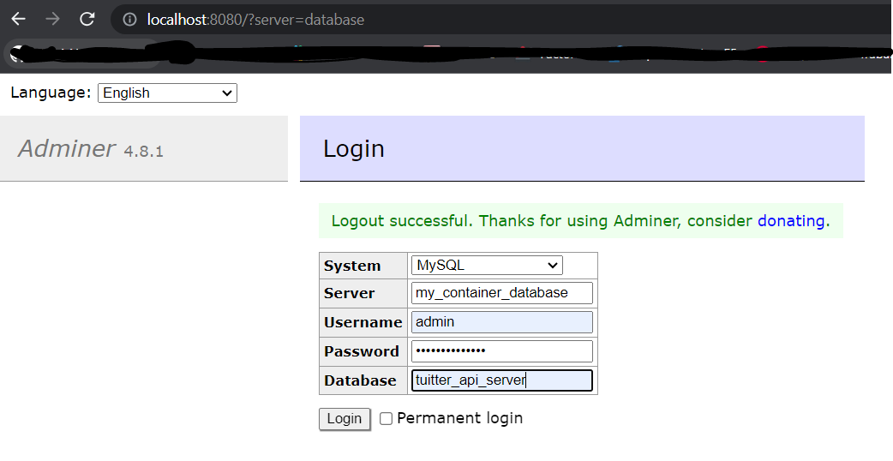

<p align="center">
  <a href="http://nestjs.com/" target="blank"></a>
</p>

[circleci-image]: https://img.shields.io/circleci/build/github/nestjs/nest/master?token=abc123def456
[circleci-url]: https://circleci.com/gh/nestjs/nest

 
## Description


## Installation

```bash
$ npm install
```

## Running the app as container (local)
To run the application as a container on your local machine, follow these steps:

```bash
# Start the required services using Docker Compose:
$ docker compose up -d 
# Or just write this code (Build the Nest.js application)
$ nest build

# Build the Docker image for the application:
$ docker build -t tuitter-app .

# Run the Docker container:
$ docker run -p 3000:3000 --network tuitter-api_default tuitter-app

# Execute
$ nest start --watch

```
The application should now be running on http://localhost:3000/tuits

## app.module (local)
#To use the container should change <br>
host: 'my_container_database'  and port: '3306' (specified in docker-compose.yml)
```
import { Module } from '@nestjs/common';
import { TypeOrmModule } from '@nestjs/typeorm';

import { TuitsModule } from './modules/tuits/tuits.module';
import { UsersModule } from './modules/users/users.module';

@Module({
  imports: [TuitsModule, TypeOrmModule.forRoot({
    type: 'mysql',
    host: 'localhost',
    port: 3307,
    username: 'admin',
    password: 'mysql-password',
    database: 'tuitter_api_server',
    entities: ['src/**/*.entity{ts,js}'],
    autoLoadEntities: true,
    synchronize: true
  }), UsersModule],
})
export class AppModule {}


```
## Adminer (mysql-workbench)

